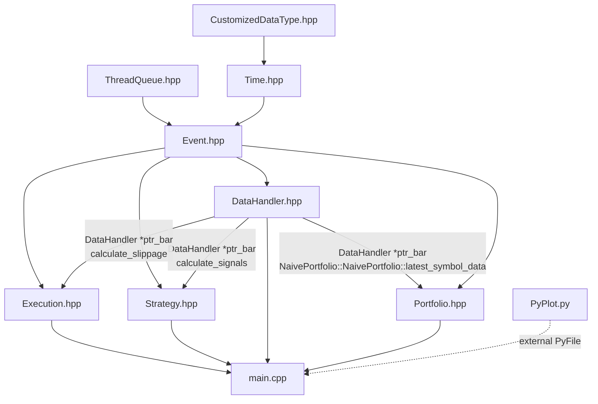
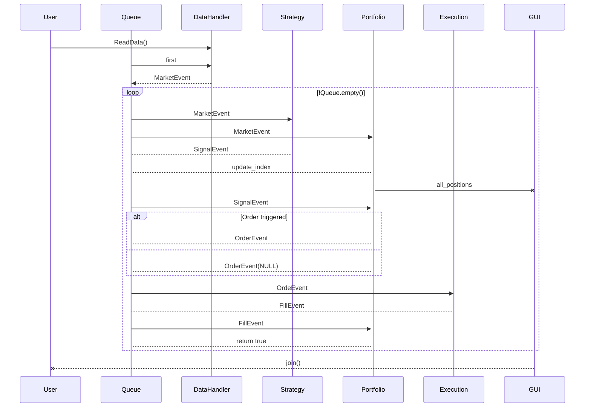

#### Structure

#### Prototype

~~~c++
DataHandler();
DataHandler: public HistoricCSVDataHandler(std::shared_ptr<ThreadQueue<Event *> > ptr_queue, std::shared_ptr<std::map<char *, int> > symbol_list, const char *start_date, const char *end_date, const char *path = "./");

Strategy();
Strategy: public BuyAndHoldStrategy(DataHandler *ptr_bar, std::shared_ptr<ThreadQueue<Event *> > ptr_queue, std::shared_ptr<std::map<char *, int> > symbol_list);

Portfolio();
Portfolio: public NaivePortfolio(DataHandler *ptr_bar, std::shared_ptr<ThreadQueue<Event *> > ptr_queue, std::shared_ptr<std::map<char *, int> > symbol_list, double initial_capital);

ExecutionHandler();
ExecutionHandler: public SimulatedExecutionHandler(std::shared_ptr<ThreadQueue<Event *> > ptr_queue, DataHandler *ptr_bar, const char *ALGO = "ALGO")

ExecutionHandler: public IBExecutionHandler(std::shared_ptr<ThreadQueue<Event *> > ptr_queue, const char *order_routing = "SMART", const char *currency = "USD")
~~~

#### Latent variable

`symbol_list` `std::shared_ptr<std::map<char *, int> >`

`ptr_event` `std::shared_ptr<std::queue<Event *> >`

`symbol_data` `std::unique_ptr<symbol_type>`

`latest_symbol_data` `std::unique_ptr<symbol_type>`

`DataHandler object`

#### UML

